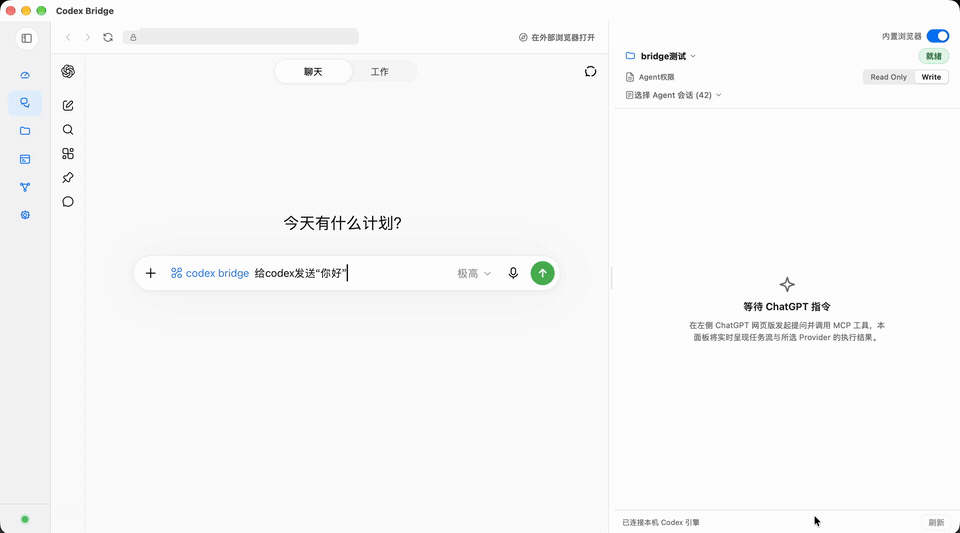
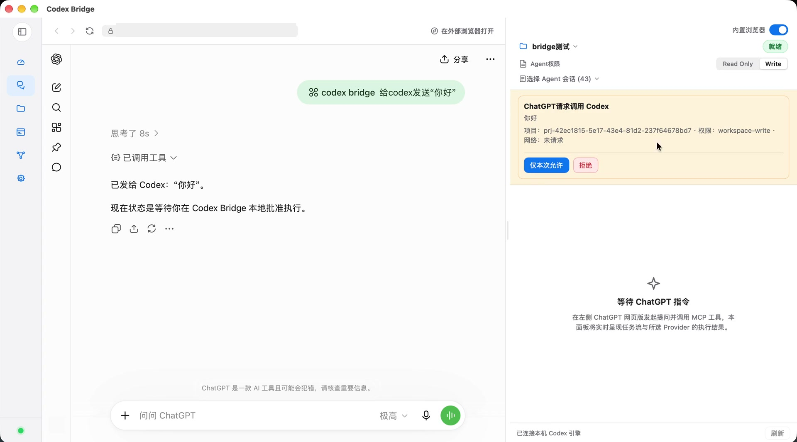
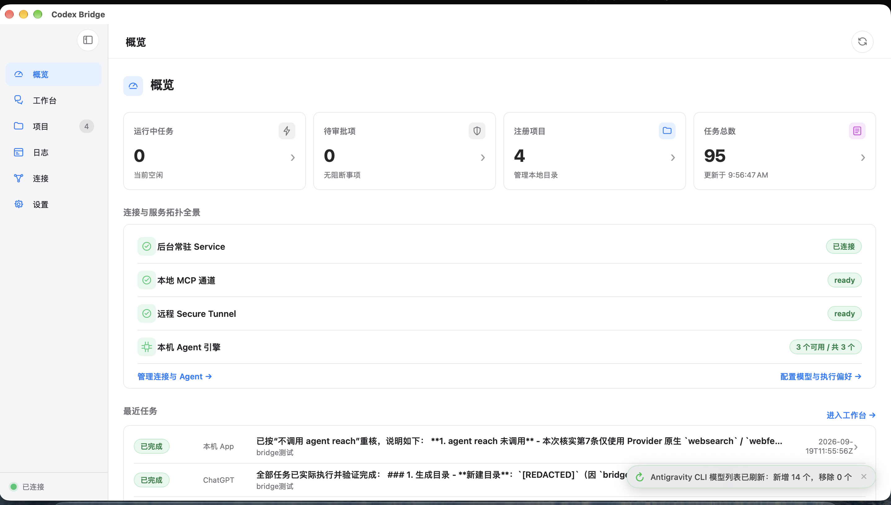
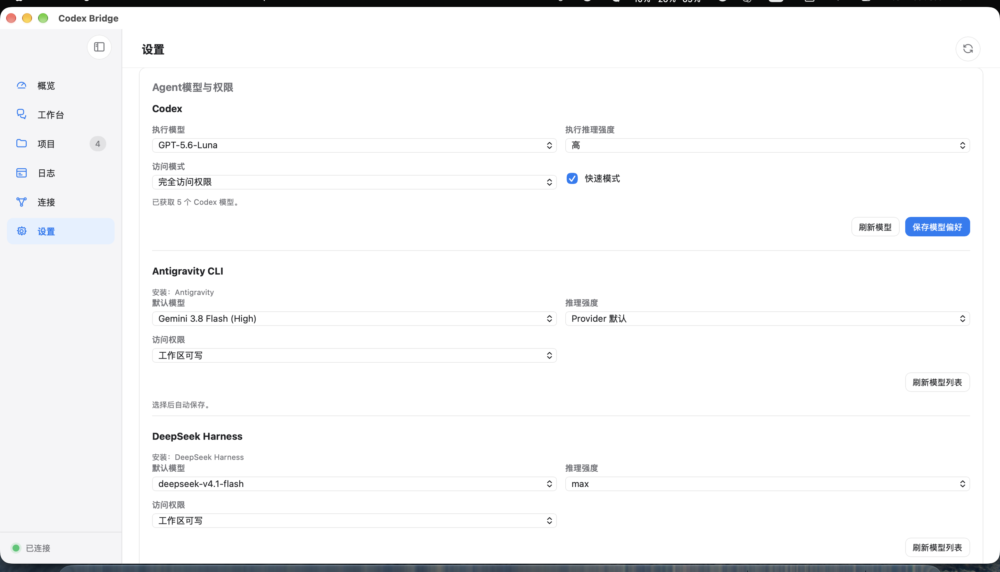
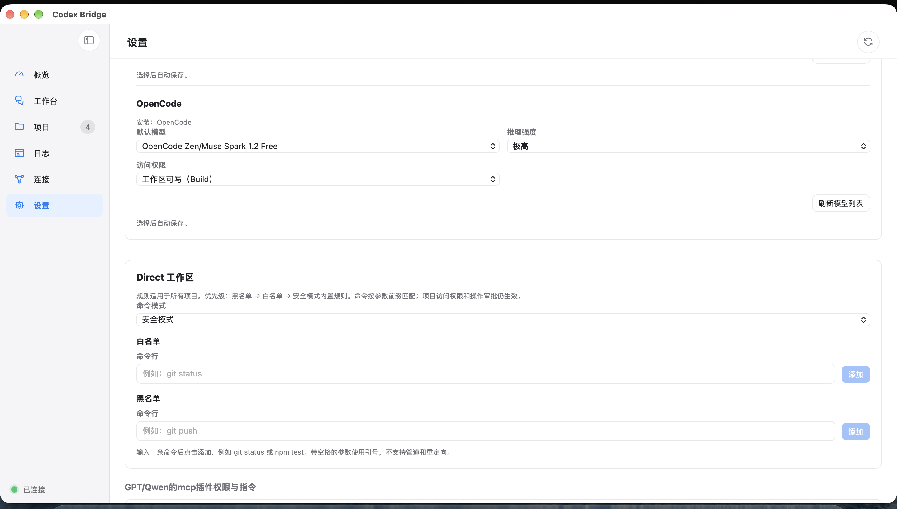
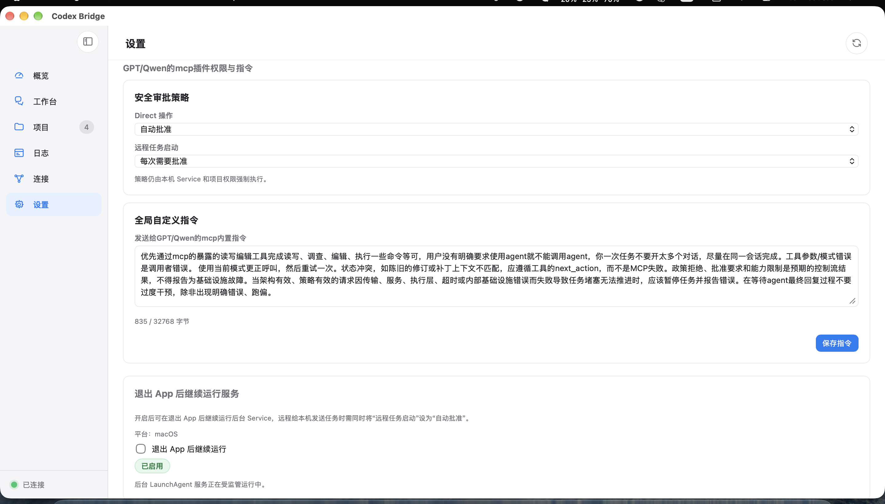

# Codex Bridge

[简体中文](./README.md) · [English](./README_en.md)

[Published on the official MCP Registry.](https://registry.modelcontextprotocol.io/v0.1/servers/io.github.Fanch-hui%2Fcodex-bridge/versions/latest)

Codex Bridge is a self-hosted desktop app and background service that connects ChatGPT on the web, [OpenAI Dot](#use-with-openai-dot), Qwen Studio, and a local workbench to explicitly authorized projects. It manages tasks, approvals, and conversations across Codex, OpenCode, DeepSeek Harness, Antigravity, Pi, and Qoder.

macOS, Windows, and Linux share the Swift core and desktop UI. Project directory authorizations, configuration, and task history are stored locally. Requests are sent to the services you choose when using ChatGPT or a model API.

The current release is [v2.0.2](./docs/RELEASE_NOTES_v2.0.2.md).

## Download and install

Get the latest version from [GitHub Releases](https://github.com/Fanch-hui/codex-bridge/releases/latest).

| Platform | v2.0.2 package | Installation |
| --- | --- | --- |
| macOS 14+, Apple Silicon | `CodexBridge-2.0.2-macos-arm64.dmg` | Open the DMG and drag the app to Applications |
| macOS 14+, Intel | `CodexBridge-2.0.2-macos-x86_64.dmg` | Open the DMG and drag the app to Applications |
| Windows x64 | `CodexBridge-Windows-x64-2.0.2-Setup.exe` | Run the installer and choose an installation folder |
| Windows ARM64 | `CodexBridge-Windows-arm64-2.0.2-Setup.exe` | Run the installer and choose an installation folder |
| Windows x64 / ARM64, portable | `codex-bridge-windows-x64.zip` / `codex-bridge-windows-arm64.zip` | Extract the complete archive and run `codex-bridge-windows-app.exe` |
| Ubuntu 24.04 LTS x64 | `CodexBridge-Linux-x64-2.0.2.deb` | Install with APT; see the [Linux guide](./docs/LINUX.md) |
| Ubuntu 24.04 LTS ARM64 | `CodexBridge-Linux-arm64-2.0.2.deb` | Install with APT; see the [Linux guide](./docs/LINUX.md) |
| Ubuntu 24.04 LTS x64 / ARM64, portable | `codex-bridge-linux-x64-2.0.2.tar.gz` / `codex-bridge-linux-arm64-2.0.2.tar.gz` | Extract the complete archive and run `./codex-bridge` |

The macOS package is ad-hoc signed and is not Apple-notarized. If macOS blocks the app, allow it in System Settings → Privacy & Security. Windows requires WebView2 Runtime; the app reports a missing runtime.

Upgrades preserve application data and the embedded browser profile. Closing the Windows main window keeps the tray icon; use the tray menu to exit.

Versions with the built-in updater check GitHub once at startup and show available updates on the overview page. Choose Update to download and install; installation waits for active work to finish, then restarts the app. After every update, refresh the plugin in ChatGPT to prevent stale caches (see [ChatGPT Guide](./docs/CHATGPT_DEVELOPER_MODE.md#8-版本更新后在-chatgpt-刷新插件防旧版缓存)). On Linux, the update action opens the matching `.deb` download; install it with the system package manager and restart the app. Settings also provides a manual check. Older versions need one manual installation of an updater-enabled release.

## Screenshots and task demo

Recorded on macOS; Windows and Linux use the same shared product UI. This 15-second demo follows ChatGPT submitting “你好” → local approval → Codex execution → the response in the workbench.



<details>
<summary>View the task approval screen</summary>

The local approval card shows the pending operation; choosing “Allow once” continues the task.



</details>

<details>
<summary>View the overview and settings screens</summary>

The overview shows the background service, local MCP channel, Secure Tunnel, Agent engines, and recent task status.



The Agent settings show models and permissions. Reasoning options depend on the model; Antigravity encodes the reasoning level in its model ID.



OpenCode model and permission settings, followed by Direct Workspace command mode, allowlist, and blocklist.



The approvals and MCP settings page shows Direct operation and remote task launch policies, along with custom GPT/Qwen MCP instructions.



</details>

## User guides

- [Complete user guide (Chinese)](./docs/USER_GUIDE.md)
- [ChatGPT / Tunnel / OpenAI Runtime API Key (Chinese)](./docs/CHATGPT_DEVELOPER_MODE.md)
- [DeepSeek Harness ACP installation and API configuration](./docs/DEEPSEEK_HARNESS_CONNECTION_GUIDE_en.md) · [Native desktop connection (Chinese)](./docs/DSH_NATIVE_DESKTOP_GUIDE.md)
- [Pi and Qoder installation, regions, and connections](./docs/PI_QODER_CONNECTION_GUIDE_en.md)
- [OpenCode (Chinese)](./docs/OPENCODE_CONNECTION_GUIDE.md) · [Antigravity (Chinese)](./docs/ANTIGRAVITY_CONNECTION_GUIDE.md)
- [MCPB client connection and Registry publishing (Chinese)](./docs/MCP_REGISTRY.md)

## First setup

**For local file access and command execution, register a project directory, then set up the Tunnel and add and enable the Codex Bridge plugin. No agent installation or connection is required.** Direct Workspace performs these operations under the registered project directory, Direct execution rules, and approval settings.

### Local files and commands

1. Open the app and confirm that the background service is connected. Approve the macOS background item if prompted.
2. Register a local project directory to authorize full access to that directory.
3. For ChatGPT / Dot, follow the [Tunnel guide](./docs/CHATGPT_DEVELOPER_MODE.md) to configure the Tunnel and add and enable the plugin (ChatGPT requires Plus or higher, or a Team subscription). Qwen Studio uses loopback HTTP MCP; the Connections page provides its configuration.
4. In a conversation with the plugin enabled, ask it to read or edit project files or run commands. Handle any required approvals in Bridge.

### Delegate agent tasks (optional)

To delegate work to Codex, OpenCode, DeepSeek Harness, or another agent, complete these additional steps:

1. Bridge discovers existing agents on first initialization; click **Connect** on the Connections page to verify and enable them. The additional **One-click setup** action prepares missing software and dependencies, then guides you through native sign-in or API configuration. See the [setup guide (Chinese)](./docs/AGENT_SETUP_GUIDE.md). Codex uses the local Codex execution channel.
2. Select a project, agent, and **Read Only** or **Full** in the workbench, and configure its model preferences. Full includes writes and network tools; Read Only allows neither. ChatGPT/Qwen tasks inherit the default task permission selected by the user in the workbench.
3. Submit a task locally or call `submit_task` from the connected chat client. Follow output, tools, approvals, and structured questions in the workbench.

Existing DSH connections and one-click setup use ACP by default. To share official desktop sessions, explicitly select [native desktop mode (Chinese)](./docs/DSH_NATIVE_DESKTOP_GUIDE.md). It reuses Desktop sign-in and tools and supports Full text tasks on macOS and Windows x64. Model and reasoning selections in this mode also update the DSH Desktop default for future sessions.

Credentials are managed through the operating system credential store. Remove credentials before sharing configuration, logs, or screenshots.

## Use with OpenAI Dot

**Dot can read and edit local project files and run commands directly through Codex Bridge, without installing or connecting an agent or starting Work or Codex.** The local Bridge service performs these operations through Direct Workspace, using the registered project directory, Direct execution rules, and approval settings. The project maintainer has tested file access through this workflow and reports a better plugin experience with Dot.

After [connecting the ChatGPT plugin](./docs/CHATGPT_DEVELOPER_MODE.md), enable Codex Bridge for your account and keep its connection active, then ask Dot to work directly with an authorized project. Existing plugin permissions apply; see OpenAI's [plugin connection guide](https://learn.chatgpt.com/docs/dots/computers-and-apps#connect-apps).

- **Access:** As of October 2, 2026, Dot is rolling out to Pro 100/200/500, Business Premium, and Enterprise. Pro access requires age 18+ outside the EEA, UK, and Switzerland; Enterprise requires admin enablement. See [availability](https://learn.chatgpt.com/docs/dots#access).
- **Direct file operations:** Calling Bridge's file tools directly creates no Work or Codex task, so it does not consume either task allowance. Dot conversations do not use your ChatGPT allowance; deeper work has a separate plan allowance. See [official usage details](https://learn.chatgpt.com/docs/dots#access).
- **Delegated tasks:** If you separately ask Work, Codex, or another agent to execute a task, the product or model service used applies its own usage and billing rules.

## Capabilities

- **Codex:** Thread/Turn, streaming output, approvals, structured questions, steer, and interrupt; macOS recognizes both current and legacy bundled CLI layouts.
- **OpenCode:** ACP, model and reasoning options, permissions, and conversation continuation.
- **DeepSeek Harness:** ACP and native desktop connections, live model catalogs, shared desktop sessions, and opening the corresponding desktop session; ACP search and MCP configuration.
- **Antigravity:** CLI integration, model IDs that include reasoning levels, native permission policies, execution progress, and conversation continuation.
- **Pi:** native CLI and sessions, model catalog, MCP, Skills, and task continuation.
- **Qoder:** native CN/international CLI and SDK integration, region isolation, permission modes, tool approvals, and session continuation.
- **Workbench:** project sessions grouped by agent, history paging, tool cards, approvals, failed-task retries, and cross-agent handoff.
- **Direct Workspace:** controlled file access, patches, command execution, and Git operations.
- **Skills:** local discovery, read-only inspection, and explicit actions.

Effective capabilities depend on the agent, its connection probe, the registered project directory, and user-selected task permissions. Requests without `project_id` use the workbench default project; requests without `provider_id` use Codex.

## Task concurrency limits

macOS, Windows, and Linux use the same task concurrency rules:

| Scope | Limit |
| --- | --- |
| Same project | One active write task, shared across all agents |
| Different projects | Write tasks can run concurrently, subject to the selected agent's limits |
| Codex | Up to four concurrent execution sessions, counting read-only and write sessions together |
| External agents | Bridge imposes no single global concurrency cap; project write slots, provider limits, and local resources still apply |

Write tasks awaiting local approval, starting, running, waiting for permission approval, or in an unknown state hold the project's write slot. At capacity, a new task is rejected or fails to start and must be retried after a slot becomes available; it is not automatically queued. Stored task history does not count toward execution concurrency limits.

## Architecture

```text
ChatGPT Web ── Secure MCP Tunnel ─┐
Qwen Studio ── localhost MCP ────┼─► Codex Bridge Service
Desktop App ── local IPC ────────┘   ├─ Project policy and approvals
                                    ├─ Tasks, conversations, SQLite
                                    ├─ Codex / OpenCode / DSH / AGY / Pi / Qoder
                                    └─ Direct Workspace / Skills
```

macOS uses WKWebView and XPC; Windows uses WebView2 and named pipes; Linux uses GTK 3 / WebKitGTK 4.1 and Unix domain sockets. All three use `BridgeDesktopUI` and `BridgeServiceAppCore`; Windows and Linux also share desktop state and command adapters in `BridgeDesktopShell`. Active conversations retain independent streaming subscriptions.

## Build from source

The default development branch is `win`.

```bash
git clone --branch win https://github.com/Fanch-hui/codex-bridge.git
cd codex-bridge
```

### macOS Apple Silicon / Intel

Install Xcode and a compatible Swift toolchain.

```bash
Scripts/with-xcode.sh xcodebuild \
  -project CodexBridge.xcodeproj -scheme CodexBridge \
  -configuration Debug -destination 'platform=macOS,arch=arm64' \
  -derivedDataPath .build/Xcode build CODE_SIGNING_ALLOWED=NO
```

A standard source build supports local MCP. ChatGPT Secure Tunnel also requires a verified `tunnel-client`; release packages include it.

For Intel Macs, replace `arch=arm64` with `arch=x86_64`. The release script also accepts either architecture.

### Windows x64 / ARM64

Install Swift 6.3.3, Visual Studio C++ tools, Windows SDK, SQLite through vcpkg, and Inno Setup 7.1.0 for installer generation.

```powershell
pwsh -File Scripts/build-windows.ps1 `
  -VcpkgRoot 'D:\Dev\Tools\vcpkg' `
  -Installer -ISCCPath 'C:\Program Files (x86)\Inno Setup 7\ISCC.exe'
```

The script uses `swiftbuild` and writes the portable ZIP and EXE installer under `.build`.

The build script defaults to the host architecture. Use `-Architecture x64` or `-Architecture arm64` to select a target, with the matching `x64-windows` or `arm64-windows` vcpkg SQLite triplet.

### Ubuntu 24.04 x64 / ARM64

The Linux desktop uses GTK 3 and WebKitGTK with the shared workbench and project interface. Builds produce `.deb` and portable archives. See the [Linux guide](./docs/LINUX.md) for dependencies, build commands, and data locations.

## License and privacy

[Apache-2.0](./LICENSE) · [Third-party notices](./NOTICE) · [Dependencies](./docs/DEPENDENCIES.md) · [Privacy](./PRIVACY.md) · [Security](./SECURITY.md)

## Community

Thanks to the [LINUX DO](https://linux.do/) community.
